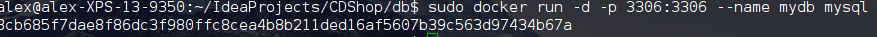
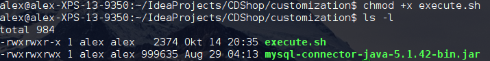

**MySQL**

1. Ordner db erstellen und darin create.sql und Dockerfile erstellen
create.sql:
 
Dockerfile:

create.sql erstellt das Schema und einen User, der von außen darauf zugreifen darf.

2. Das Image für die Datenbank von der Dockerfile builden

3. Die Datenbank im Hintergrund starten und den Port der DB freigeben.

4. Überprüfen, ob die DB funktioniert

**Wildfly**

1. Dockerfile im Root des Projekts erstellen

2. Customization Ordner erstellen und darin den mysql jdbc connector kopieren
3. execute.sh in den customization Ordner kopieren
4. IP des mysql Containers ermitteln

5. DB-Connection Variablen in execute.sh setzen

6. Dateinamen der war File anpassen

7. execute.sh ausführbar machen

8. Image von der Dockerfile builden

9. Container mit dem wilfly Image im Hintergrund starten und den Port des Wilflies zur Verfügung stellen

10. Überprüfen, ob alles funktioniert

11. Die Tabellen der DB wurden automatisch erstellt

**Compose**
Um nicht jedes mal beide Container starten zu müssen, verwenden wir docker-compose

1. docker-compose.yml im Root des Projekts erstellen

2. Den Hostname der DB auf den Namen des Services ändern, da wir dank Compose keine IPs mehr verwenden müssen.

3. Die Images mithilfe von docker-compose builden

4. Compose starten

**Ende**
Mithilfe von Docker und Compose können wir unserere Applikationen entwickeln und es wird gewährleistet, dass es auf allen Systemen gleich läuft.